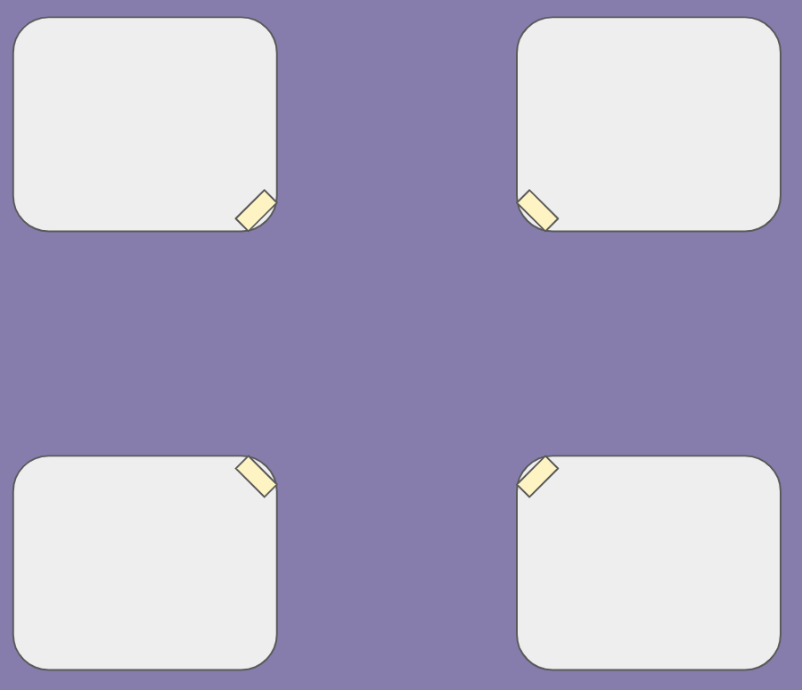
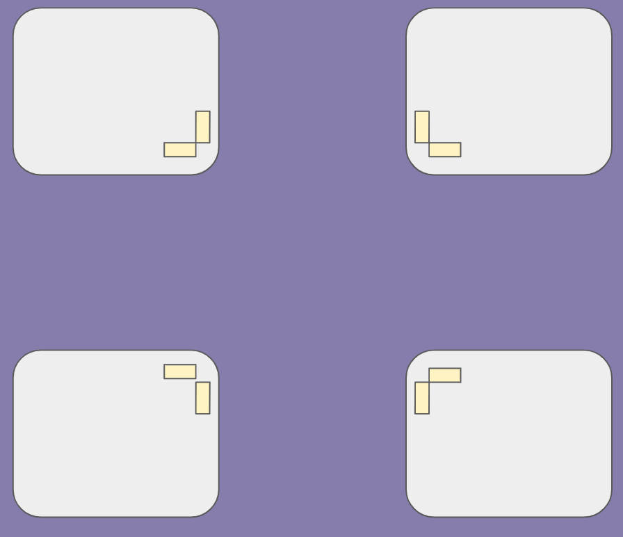

This week, I'm going to try a new format where I document what I did each day, to see if I can document more of what I'm up to on a day-to-day basis.

Monday: Today I worked on finishing annotating a reading that was sent to everyone working on the OpenSidewalks for Equity Collection Efforts team. After that, and adding my weekly update to this site, I continued my work on the app. Today's app work was mostly spent renaming the modules on a previous member of the team's app, so that it will be easier to incorporate her work into my final app.

Tuesday: Today, I continued the dive into the previous app to try and develop a plan for how I would incorporate previous logic and questions into the app that I'm working on. So far, I have converted one whole page of the previous app onto the new app and am hoping to be done with a few more in the next day or two. This afternoon, we had our all-lab meeting! In the meeting we discussed another article, and it was really cool for me to hear conversations that I would typically hear in my social science major (such as discussions of ethics, epistemology, etc.) based in computer science conversations. After that, the OpenSidewalks for Equity Collection Efforts team had our meeting, where I showed the current state of the app and got feedback from my mentor and others on the team- lots of exciting changes to make!

Wednesday: After the feedback from yesterday, I started thinking about ways to make the app more image-based and less text-heavy. One idea that we discussed in the meeting was to have images depicting what the various corners of the intersection could look like (i.e. one might have a single ramp facing into the center of the intersection, while another could have two ramps facing the two adjacent corners). Here is an example of what these images could look like- the first photo depicts an intersection with four corners that each have one ramp and the second depicts an intersection with four corners that each have two ramps). 

These, of course, are only mock ups of what a potential intersection could look like. The idea for this format was presented by my mentor in our meeting yesterday. My task now is to think about how best to implement this. An idea that I am currently working with is having the user select for each corner whether there are one or two ramps- then showing the configured picture that matches their input for them to confirm at the end. I'm unsure how this will work for alternative intersections other than 2, 3, or 4-way intersections, but I will keep working on it!

Thursday: Today I continued a search for better pictures to depict a three-way intersection that shows the intersection clearly. Thus far, I haven't had any luck, but I will continue to search until I find something that I feel good about. After that, I started thinking about how to do the logic for the confirmation images, but think I have a schema that will work using the "get" function of the database for App Inventor. The next step will be implementing this logic.

Friday: Today I cleaned up the old parts of the app so that I can start incorporating the new method of asking about curbs. App Inventor wants no more than ten screens, so I worked to condense some of my old screens onto a single screen where it made sense. Next week I will be able to actually work on the screen where users select what each corner looks like. I think this will be a tedious process to get something I'm happy with but I'm excited to work on it. For the last part of the day, I uploaded my journal entries from the week!

